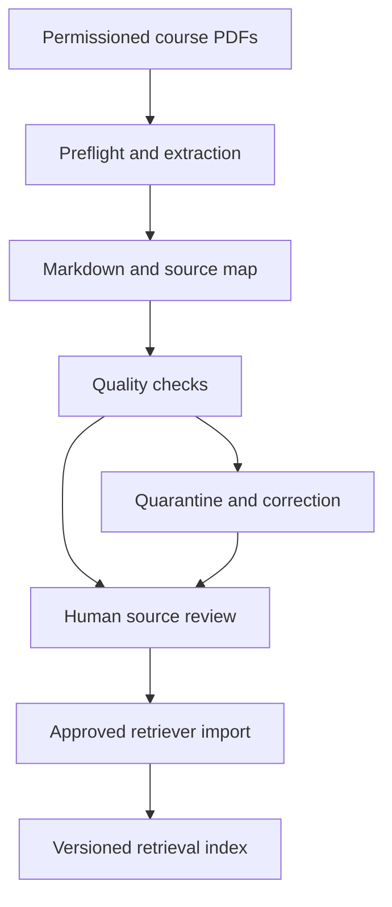

# PDF-to-Markdown Ingestion Tool: Project Plan

Version: 0.1 | Date: 9 October 2026 | Status: proposed development plan

Purpose: convert permissioned English course PDFs into readable Markdown and structured, traceable text for the Medical AI Education Project's retriever. This is a plan, not an implemented or measured converter.

## 1. Recommendation and grades

Build this as an offline ingestion utility before expanding the retriever's source corpus. Use existing PDF/layout/OCR libraries. Write the project-specific source mapping, review rules and retriever adapter around them.

| Question | Grade | Assessment |
|---|---:|---|
| Usefulness for this project | 9/10 | Reduces repeated manual conversion and supports source inspection, citations and reproducible indexing |
| Feasibility of a reviewed local converter | 9/10 | Existing extraction/layout/OCR tools provide the main processing components |
| Clean digital PDFs | 9/10 | Best first scope; text exists in the PDF, although reading order still needs checks |
| Clear printed scans with review | 8/10 | OCR is practical; terms, symbols and numbers require checking |
| Complex tables and multi-column layouts | 7/10 | Supported by layout tools, but difficult cases require structured output and review |
| Handwriting, formulas and image-heavy pages | 5/10 | Exclude handwriting and diagram interpretation from the first version; preserve unresolved content for review |
| Fully automatic, error-free conversion of arbitrary medical PDFs | 3/10 | Not a realistic release requirement; use rejection/review instead of guessing |

These grades are planning judgments. They are not extraction accuracy percentages or probabilities of successful delivery.

The useful product produces more than an .md file. It also preserves where every extracted block came from, which processing path produced it, and whether it is approved for indexing. A readable conversion can still contain a wrong number or table association.

Markdown improves human review and structured editing. It does not increase source quality or automatically improve retrieval accuracy. The retriever ultimately indexes the approved passage text and metadata, regardless of the original file extension.

## 2. Role in your AI structure



This runs when a source is added or changed. It does not run for every student question. Gate, retriever, Brain and verifier retain their existing request-time responsibilities.

The converter replaces/extends the retriever's offline parse adapter. It does not replace the retriever's chunker, embeddings, search, permissions or answer verifier. A successful conversion never activates a source or indexes it automatically.

English is the fixed project language. Do not add translation or language selection. English OCR configuration still permits scientific symbols and technical text; unexpected scripts or badly recognized terms require review, not automatic translation.

## 3. First-version scope

### Included

- Local, permissioned digital PDFs containing course notes, lecture slides or permitted textbook excerpts.
- Paragraphs, headings, lists and simple tables.
- Physical PDF page indices, printed page labels where verified, block positions and section hierarchy.
- Human-readable .md export and a structured JSONL record for each block.
- Conversion reports, exact source-file hashes and versioned corrections.
- Optional English OCR profile for clear printed scans after the native-text profile is evaluated.
- A local review workflow and an explicit retriever import adapter.

### Excluded initially

- Live websites, arbitrary student uploads, patient records and automated textbook acquisition.
- Handwriting recognition, chemical-structure interpretation and histology image diagnosis.
- Generative rewriting, summarization, gap filling or changing source wording to sound better.
- Automatic formula reconstruction, diagram descriptions or chart interpretation.
- Automatic permission approval, faculty approval, publication or index activation.

Approved figure captions may be extracted as source text. An image without an approved textual key is recorded as a non-indexed figure region. The converter must not invent an explanation for it.

## 4. Tool choices

| Component | Proposed choice | Purpose |
|---|---|---|
| Structured PDF conversion | Docling standard PDF pipeline | Layout-aware extraction and structured document representation |
| PDF preflight/reference extraction | pypdf | Page count, labels where available, metadata and native-text diagnostics |
| Optional scan OCR | Docling's local Tesseract CLI adapter, English model | Printed-text recognition under an explicit OCR profile |
| Canonical records | Pydantic schemas and JSONL | Validated source blocks and provenance |
| Markdown export | Deterministic serializer over canonical blocks | Readable output with stable block/page markers |
| Review previews | Local rendered PDF pages | Compare extracted content with actual page appearance |
| Job tracking | SQLite or a local JSON job manifest in the MVP | Resume/retry and prevent duplicate imports |

Docling exposes document hierarchy, tables and provenance and can export Markdown. Its documentation also provides offline model provisioning. Configure that explicitly; default first-use downloading is incompatible with this project's runtime rule.

pypdf is useful for native-text extraction and preflight. Its documentation explains limitations with scans, layout and semantic structure. It should not be the sole authority for complex reading order or tables.

Tesseract is a local OCR engine for printed text. Pin the engine and English trained-data files. Do not train a new OCR model for the initial build. Do not enable automatic language detection or a remote OCR service.

OCRmyPDF is an optional future preprocessing step when a searchable PDF derivative is useful. It is not required to produce Markdown and should not become an extra default dependency.

### Profiles

- `native_layout_v1`: Docling standard PDF extraction, OCR disabled, table structure enabled, remote services/enrichment disabled. Initial default for digital PDFs.
- `english_ocr_v1`: separately selected and evaluated local OCR profile, with explicit English OCR models and provenance. Use for approved scans or pages flagged for OCR.
- `simple_native_v1`: optional later pypdf-only profile for verified simple PDFs. It requires its own fixtures/evaluation; do not silently switch to it when the default fails.

A conversion failure does not trigger an invisible fallback. Request an explicit retry/profile selection and record the new conversion. Do not use a generative vision-language model as the default transcription engine.

## 5. Hardware and operating model

Your Ryzen 7 5800X and RTX 3070 Ti provide a practical basis for local development. Begin on CPU with one document worker. Conversion is offline, so it can run separately from live tutor use.

- Do not load the main Brain model to perform ordinary PDF extraction.
- Test the selected Docling profile's model memory, page throughput and peak RAM. Your installed system RAM is not specified here.
- GPU acceleration is optional after testing. If enabled, run conversion when the Brain is unloaded or enforce measured allocation limits. Do not assume both fit concurrently.
- Start with a queue of eight jobs and one active conversion. Bound worker threads and per-job memory/time separately from request-time services.
- Initial import limits: 100 MiB per PDF, 2,000 pages, and an operator-configurable page-range limit. File size alone does not bound decompressed PDF memory.
- Run parsers/renderers/OCR in a restricted worker process with no network access, bounded scratch space and enforced termination. Initial configurable budget: 30 minutes/job and 120 seconds/page, with the earliest exhausted budget stopping the job.
- Set memory limits from measured available RAM during installation; refuse worker startup if no resource limit can be enforced or validated for the chosen deployment profile.
- Long books can be converted as explicit page-range jobs. Every output keeps the original PDF page index; page ranges never renumber the source from one.

These are development defaults and benchmark tasks. No pages-per-second or total-book processing time is claimed.

## 6. Conversion workflow

### Step 1. Register the source

Accept source_id, source_version, title, course/library assignment, rights_reference, original local PDF path, selected conversion profile and optional page range. The file must reside under an operator-configured import root.

Rights to process and display excerpts, content approval and source eligibility remain separate fields. Synthetic developer PDFs can test the tool without real course data. A permissioned source awaiting faculty content review can be converted privately, but its result is not indexable.

### Step 2. Preflight

Validate the PDF signature/parser result, source hash, file/page limits, page range and access scope. Reject URL inputs, path traversal, symlink escape, unsupported files and unapproved source acquisition. Password-protected files return a specific blocked result; authorized decryption is a separate operator action and credentials are never logged.

Inventory every requested physical page. Record text-layer presence, extraction diagnostics, page dimensions, rotation and available printed labels. Sparse text is a review signal, not proof of a scan or a blank page.

### Step 3. Extract structured blocks

Use the selected profile to produce headings, body paragraphs, lists, captions, tables and non-text regions with origin information. Preserve reading order and distinguish body from page furniture.

Normalize adapter coordinates to top-left, rotation-corrected page coordinates in [0,1]. Record the original coordinate convention and transformation. The adapter must verify its raw page-number convention and normalize to positive 1-based PDF indices using fixtures.

For scanned or broken-text-layer pages, the native profile records OCR_REQUIRED or TEXT_LAYER_UNRELIABLE. An explicit OCR retry generates a new extraction record. Existing OCR text in a PDF is not automatically trustworthy.

### Step 4. Normalize conservatively

Preserve numbers, decimal separators, negative signs, inequalities, negations, Greek symbols, units and footnotes. Keep original extraction text alongside normalized text. Log every applied transformation with block IDs.

Safe initial transformations include line-ending normalization, Unicode NFC and joining verified within-paragraph line breaks. Do not apply blanket NFKC to source text: it can change the representation of superscripts and unit symbols. Do not remove punctuation, repair medical spelling, merge columns or dehyphenate terms without a tested rule. Optional dehyphenation must preserve original text and flag ambiguous cases.

Repeated headers/footers are excluded only when a reviewed source/profile rule identifies them. Preserve them in provenance records with `index_candidate=false` and a reason. A phrase near a page margin is not automatically disposable.

### Step 5. Preserve tables and unresolved content

Simple verified rectangular tables can render as Markdown tables, retaining headers, units and footnotes. Escape Markdown control characters without changing canonical cell text.

Merged cells have no equivalent in ordinary Markdown table syntax. Keep cell coordinates, spans, headers and footnotes in structured JSON. Mark the Markdown rendering as a review display. Do not allow the retriever to ingest a flattened merged table until a reviewer approves a deterministic structured-text representation.

For unresolved formulas, handwriting, charts or complex figures, retain the page/region reference and an issue record. Their placeholders are not medical evidence. Do not fill missing material using the Brain or an external model.

### Step 6. Export and validate

Write the output bundle in a staging directory. Validate all hashes, page counts, block spans, coordinate ranges and source references. Every requested page must be accounted for as extracted, confirmed blank/non-text, excluded with reason, or unresolved. No silent page omission.

### Step 7. Review and correct

The operator compares rendered pages with extracted blocks. Prioritize OCR, numbers, table associations, columns, paragraph boundaries and flagged issues. Faculty content approval follows the project procedure.

Corrections must be traceable to the PDF, not new medical prose. Save a patch containing original/new text, affected block IDs, reason, reviewer and timestamp. Revalidate and regenerate Markdown/offsets. Editing .md alone invalidates its bundle hash until the canonical records and review state are reconciled.

### Step 8. Import through the retriever

Import only the approved bundle through a new reviewed parser adapter. It reads canonical block text/origins and ignores page markers, review messages and non-evidence placeholders. The existing retriever then chunks, embeds, validates and publishes its own immutable snapshot.

If a source bundle has unresolved evidence-bearing blocks, initial policy blocks whole-source import. Explicit reviewed exclusion is possible only when the faculty record defines the permitted source subset and its omissions. Missing material must not be presented as a complete source.

## 7. Output bundle and schemas

```text
conversion_<source_id>_<source_version>_<conversion_id>/
  document.md          Human-readable derivative
  blocks.jsonl         Canonical text, structure and page origins
  manifest.json        Source/profile/output hashes and review state
  review_report.json   Issues and reviewer resolutions
  corrections.jsonl    Optional append-only correction history
  previews/            Optional restricted local page/region previews
```

The initial four files are required for every completed extraction. Optional preview files are not evidence in the text retriever. Preserve the original PDF unchanged under the source register.

### Example Markdown

```markdown
<!-- source-id: fixture-histology; source-version: 1 -->
<!-- pdf-page: 12; printed-label: unverified -->

## Epithelial tissue

<!-- block-id: fixture-block-001 -->
Simple squamous epithelium consists of a single layer of flattened cells.
```

This is synthetic example content. Comments carry provenance but are removed from indexed text. Displayed page labels are verified source labels or explicitly unverified; do not invent printed page numbers.

### Example canonical block

```json
{
  "schema_version": "pdf-block-0.1",
  "block_id": "fixture-block-001",
  "source_id": "fixture-histology",
  "source_version": "1",
  "kind": "paragraph",
  "section_path": ["Epithelial tissue"],
  "text_raw": "Simple squamous epithelium consists of a single layer of flattened cells.",
  "text_normalized": "Simple squamous epithelium consists of a single layer of flattened cells.",
  "origins": [
    {"pdf_page_index": 12, "printed_label": null, "bbox_top_left_normalized": [0.1, 0.2, 0.9, 0.3]}
  ],
  "extraction_method": "native_layout",
  "extraction_quality": "unreviewed",
  "index_candidate": true,
  "markdown_span": {"start_line": 7, "end_line": 7},
  "issues": [],
  "text_sha256": "fixture-only"
}
```

Strict schema rules:

- kind: heading, paragraph, list, table, caption, formula, figure, furniture or placeholder.
- extraction_method: native_layout, english_ocr or reviewed_transcription.
- extraction_quality: unreviewed, approved, excluded or unresolved.
- index_candidate indicates the type's potential eligibility; it never overrides unreviewed state or source permissions.
- Every textual block has nonempty origins. Each origin has an in-range 1-based page index and a verified printed_label or null.
- Coordinates, when available, are four finite values with 0 <= x0 <= x1 <= 1 and 0 <= y0 <= y1 <= 1. Missing boxes are null and cause a specific review issue; they are not fabricated zeros.
- A paragraph spanning pages retains multiple origin records. Do not assign all its text to the first page.
- Markdown line ranges are inclusive, positive and recomputed from the actual export. Multi-line tables have matching ranges. Non-rendered/excluded blocks may have markdown_span=null.
- Real text_sha256 hashes the exact UTF-8 text_normalized bytes. Fixture-only hashes are forbidden in approved bundles.
- Heading blocks carry level/hierarchy metadata; table blocks add cell/span/header/footnote structure. Use discriminated typed payloads for these fields.
- Stable block IDs derive from source/version, origin/block anchors, content hash and conversion fingerprint. Internal running row numbers are not public evidence IDs.

manifest.json includes conversion_id, source hash/version, page range/count, converter/profile/model revisions, dependency lock hash, normalization/serialization versions, output-file hashes, page inventory, creation time, review state and approval references. Keep machine-local paths private.

review_report.json lists issue_id, severity, category, page/block references, explanation, resolution, reviewer/time and supporting correction IDs. Raw OCR confidence may be recorded, with its engine and scale. It is not a calibrated probability of correctness.

## 8. State and failure behavior

Separate extraction status from approval state.

| Field | Values |
|---|---|
| job_status | queued, running, completed, blocked, failed, cancelled |
| review_state | unreviewed, needs_review, approved, excluded |
| block quality | unreviewed, approved, excluded, unresolved |

completed means the extraction bundle was written and structurally validated. It does not mean the source is approved. approved requires valid rights/content approvals, reconciled issue resolutions and output hashes. The retriever importer rechecks them and current source eligibility.

Approval records define the reviewed scope and method. Explicitly reviewed blocks use method `direct`; otherwise unflagged blocks may be covered by a documented `source_level_sampled` approval under the Content Lead's chosen policy. Do not imply every block was manually inspected. Unresolved/flagged blocks require individual resolution or explicit reviewed exclusion. Import requires every candidate block to be covered by the current approval scope, with no unresolved issue and no excluded content.

| Code | Outcome |
|---|---|
| INVALID_INPUT / PATH_DENIED | blocked; no parser execution |
| RIGHTS_UNCONFIRMED | blocked for real-source processing; synthetic fixture mode remains available |
| ENCRYPTED_SOURCE | blocked; request separate authorized local decryption |
| FILE_LIMIT / PAGE_LIMIT | blocked; explicit page-range/new profile required |
| MODEL_UNAVAILABLE / OCR_UNAVAILABLE | failed; no runtime download or invisible fallback |
| PARSE_FAILED / RESOURCE_LIMIT / DEADLINE_EXCEEDED | failed; staged output cannot be imported |
| OCR_REQUIRED / TEXT_LAYER_UNRELIABLE / READING_ORDER_UNCERTAIN | completed with needs_review when extraction can be preserved; otherwise failed |
| TABLE_STRUCTURE_UNRESOLVED / SYMBOL_UNCERTAIN / PAGE_UNACCOUNTED | needs_review; no whole-source import |
| HASH_MISMATCH / INVALID_PROVENANCE | invalid bundle; importer rejects it |

Keep partial failed output only in a restricted diagnostic staging location with failed status. Never label it completed or move it into approved imports. Batch processing continues for independent files and reports each result separately.

Idempotency key: tenant/source identity + source-file hash + source version and metadata fingerprint + requested page range + profile/model/dependency/normalization/serialization fingerprints. Reuse a validated identical extraction, but still recheck current rights and source approval. Do not reuse another source's bundle merely because its PDF bytes match. A rerun after corrections or model/profile changes creates a new conversion version. Source revocation blocks import even if extraction previously passed.

## 9. Quality checks and evaluation

### Automated checks

- Account for every requested page and all exported/indexable blocks.
- Validate hashes, locators, line spans and coordinate conventions.
- Detect unusually sparse/garbled text, missing units, suspicious columns and broken table/header associations as issue signals.
- Compare native-text diagnostics with the selected extractor where both exist. A disagreement triggers review; agreement alone does not establish accuracy.
- Check critical synthetic strings containing decimal numbers, minus signs, <=/>=, Greek letters, superscripts, negations and unit symbols.
- Confirm furniture, review placeholders and source markers cannot enter evidence chunks.
- Check output rendering cannot execute source scripts or fetch external resources. Keep canonical '<'/'>' text intact and escape it in the display serializer.

### Human review

Use rendered source pages alongside extracted blocks, not extracted text alone. Initial deployment requires source-level sign-off, review of every unresolved/OCR/table/formula block, and a stratified visual sample of at least 20 otherwise unflagged pages per source, or all pages if fewer. The Content Lead may require more; a sample cannot prove that all unreviewed pages are correct.

Before ordinary use, evaluate a fixed representative corpus, initially at least 30 permissioned or synthetic PDFs and 200 annotated pages. Include digital single/multi-column pages, slides, tables, clear scans, mixed native/scanned PDFs, rotated pages, blank pages and damaged text layers. Group related pages/documents together when separating development from final evaluation.

| Measure | Proposed target before approved ingestion |
|---|---|
| Page accounting | 100%; no silent missing page |
| Citation page/locator accuracy | 100% on the reviewed evaluation set |
| Synthetic critical-number/unit/negation fixtures | 100% exact preservation or explicit unresolved rejection |
| Unresolved content bypassing import review | Zero cases |
| Digital plain-text CER | <=0.5% on reviewed supported pages |
| OCR CER on clear printed scans | <=2% on reviewed supported pages; errors still require risk-sensitive review |
| Simple-table cell/header association | >=99% on reviewed supported tables; unresolved complex tables are excluded |
| Reading-order correctness | >=98% correctly ordered annotated adjacent block pairs |
| Job reliability | Report completed/blocked/failed counts separately, including exclusions |
| Resources | Measure seconds/page, peak RAM/VRAM and review minutes/page by profile |

CER is character-level edit distance divided by reference character count. Keep a separate normalization policy for metric calculation; do not normalize away medically important symbols or numbers. Report counts, distributions and failures by document type. Low average CER can hide one dangerous numeric error.

Targets are proposed and unmeasured. Freeze them before a restricted final test. Do not keep tuning against the same final documents. Evaluate review burden and unsupported cases as well as successful pages, so exclusion cannot inflate apparent automation quality.

Measure usefulness with the same approved corpus and queries: manual PDF preparation time versus converter-plus-review time, retrieval evidence coverage, citation correctness and parsing-related misses. Conversion alone earns no claim of improved answer accuracy.

## 10. Acceptance scenarios

| ID | Scenario | Expected result |
|---|---|---|
| T01 | Clean digital single-column PDF | Body/headings extracted, all pages mapped |
| T02 | Two-column page | Correct reviewed reading order or explicit uncertainty |
| T03 | Physical page 12 has printed label 8 | Both retained distinctly; citation uses verified mapping |
| T04 | Requested source pages 12 to 20 | Original indices retained; no renumbering to 1 |
| T05 | Paragraph spans two pages | Multiple origins preserved |
| T06 | Clear scanned page under native profile | OCR_REQUIRED; no false ready-for-index result |
| T07 | Explicit English OCR profile with local models | OCR provenance and review state recorded |
| T08 | Missing OCR/layout model | Failure; no network download |
| T09 | Mixed native/scanned or broken OCR layer | Page inventory and separate issues; no silent lost pages |
| T10 | Blank/figure-only page | Explicit inventory entry; no invented body text |
| T11 | Repeated header versus legitimate margin text | Reviewed exclusion only; semantic text preserved |
| T12 | Decimal, unit, Greek letter or negation fixture | Exact preservation or unresolved block |
| T13 | Simple table with footnote | Cell/header/unit/footnote relationships preserved |
| T14 | Merged table headers | JSON spans preserved; no blind flattened-table ingestion |
| T15 | Formula, handwriting or chart | Unresolved/non-indexed; no generated interpretation |
| T16 | Source text contains HTML/script or external links | Safe display; no execution or remote fetch |
| T17 | Wrong source hash/version or page locator | Import rejected |
| T18 | Direct edit of document.md | Bundle invalid until canonical records/hashes/review reconcile |
| T19 | Reviewed text correction | Versioned patch, regenerated offsets and hashes |
| T20 | Conversion completed but source unapproved | No retriever import |
| T21 | Source revoked after prior approval | Import rejected despite valid extraction |
| T22 | Duplicate job with unchanged validated fingerprints | Reuse extraction; recheck permissions |
| T23 | Profile/model/page-range changes | New conversion record; no stale-cache reuse |
| T24 | Source exceeds limits or parser hangs | Bounded failure; no partial live import |
| T25 | Encrypted, malformed or path-escaping file | Specific blocked/failed result; no secret logging |
| T26 | Several independent files, one fails | Per-file results; successful conversions do not hide failures |
| T27 | Markers/placeholders/furniture near real text | Excluded from retriever evidence |
| T28 | Converted approved source enters retriever | Original page/source version and stable block origins reach passages |
| T29 | Source page count differs from exported inventory | Needs review/failure; cannot approve incomplete source |
| T30 | Late result after cancellation/time limit | Discarded; cannot change approval/import state |

## 11. Build phases and effort estimates

Planning estimates assume one capable developer using existing packages, available sample PDFs and a reviewer. They exclude waiting for source permissions and institutional approvals.

| Phase | Deliverable | Effort estimate |
|---|---|---|
| 1. Prototype | Digital-PDF extraction, Markdown export and page inventory | 2 to 4 developer days |
| 2. Traceable MVP | Canonical blocks, manifests, review issues, corrections and retriever adapter | Additional 5 to 10 developer days |
| 3. OCR extension | Explicit English scan profile, resource control and scan-specific tests | Additional 3 to 7 developer days |
| 4. Corpus validation | Annotated evaluation, table/layout fixes, operating guidance | Depends on corpus complexity and reviewer capacity |

Build phases 1 and 2 first. Add OCR only when representative scan samples exist. A GUI, drag-and-drop upload and automated job scheduling can follow after conversion/import behavior is tested.

The first deliverable is a CLI and review report, not a full document-management website. Test both Windows deployment constraints and the selected local execution environment before promising installation support. Dependency pinning/provisioning is part of the MVP.

## 12. Suggested modules and coding handoff

```text
pdf_ingest/
  schema.py          Jobs, source blocks, tables, provenance and reports
  preflight.py       File/page/permission/resource checks
  extract.py         Explicit Docling/native/OCR adapters
  normalize.py       Conservative transformations and change log
  provenance.py      Page/coordinate/block/Markdown mappings
  serialize.py       Markdown and canonical bundle writing
  quality.py         Deterministic issue checks
  review.py          Versioned corrections and approval-state validation
  import_adapter.py  Retriever parser boundary, no index activation
  jobs.py            Bounded worker, idempotency and cancellation
  cli.py             Convert, validate, review-status and export commands
tests/               Synthetic PDFs and contract fixtures
```

Copy-ready implementation instruction:

```text
Build the PDF-to-Markdown Ingestion Tool described in Plan v0.1.
Implement the reviewed digital-PDF MVP first, using local Docling standard extraction.
Produce document.md, blocks.jsonl, manifest.json and review_report.json.
Keep every indexed text block traceable to its original source version and PDF page(s).
Use Markdown as the readable derivative and canonical structured blocks as the import authority.
Preserve numbers, units, negations, table structure and original extraction text.
Do not rewrite, summarize or fill missing source content using an LLM.
Quarantine unresolved extraction and keep completion separate from approval.
Keep OCR a separately provisioned, explicitly selected English-only profile.
Run offline with bounded workers, safe paths and no runtime model download.
Add the retriever import adapter without bypassing rights/content review or snapshot activation.
Implement the acceptance scenarios, lock dependencies and report actual test results.
Do not claim extraction accuracy until the reviewed evaluation corpus is tested.
```

## 13. References and project compatibility

Primary references checked:

- Docling usage/Markdown export: https://docling-project.github.io/docling/usage/
- Docling document structure/provenance: https://docling-project.github.io/docling/concepts/docling_document/
- Docling serialization and table-span limitations: https://docling-project.github.io/docling/concepts/serialization/
- Docling offline provisioning/options: https://docling-project.github.io/docling/usage/advanced_options/
- Docling OCR adapters: https://docling-project.github.io/docling/concepts/OCR/
- pypdf extraction limitations: https://pypdf.readthedocs.io/en/stable/user/extract-text.html
- Tesseract documentation: https://tesseract-ocr.github.io/tessdoc/

This plan extends the retriever v0.2 ingestion boundary. That specification currently quarantines scans and difficult layout until a reviewed parser adapter is added. Implementing this converter supplies that adapter through versioned development/evaluation; it does not retroactively approve OCR or table inference in the existing retriever release.

Existing gate and retriever plans remain separate. No main-model choice, live source registry, source permission or production policy is changed by this planning document.
